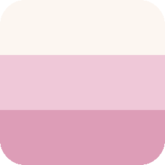
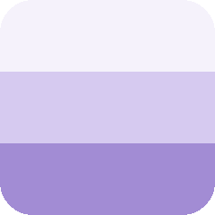
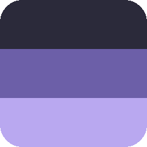
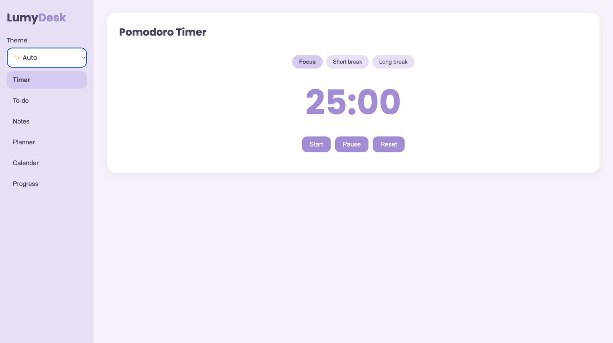
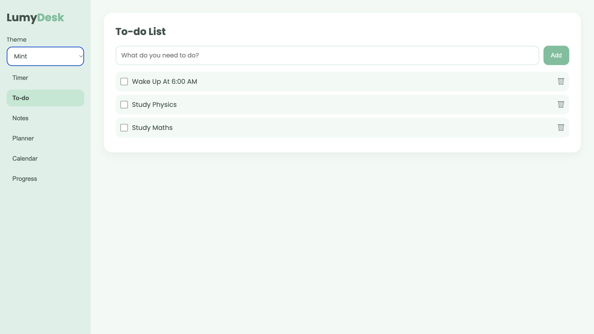
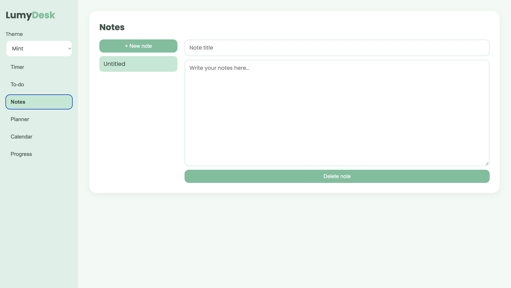
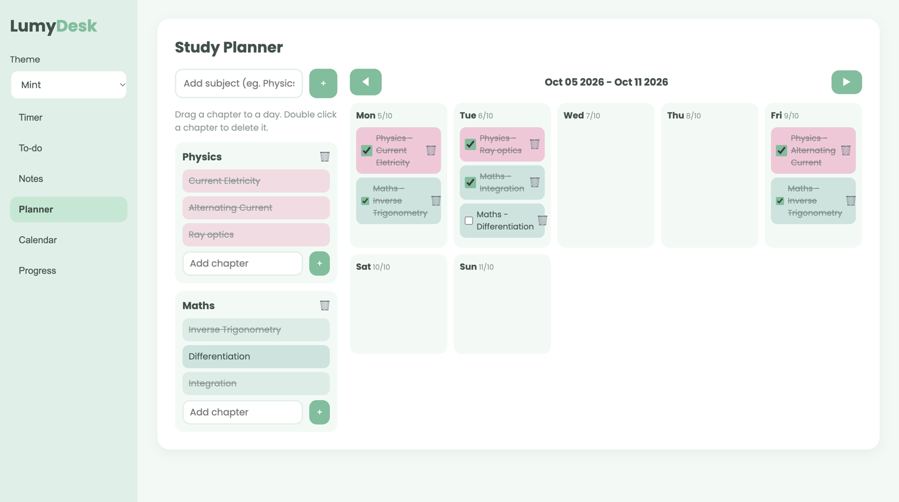
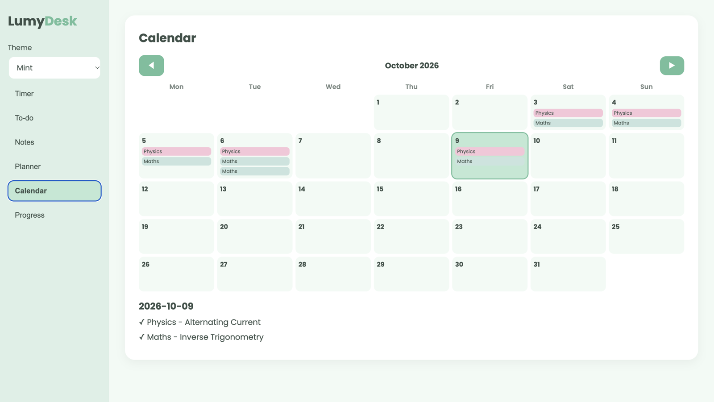
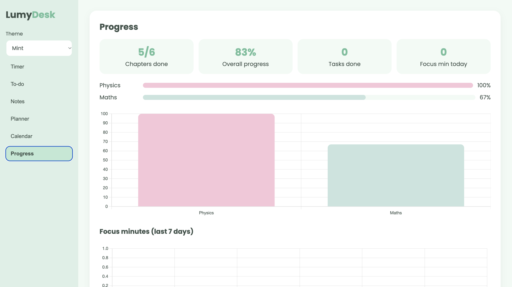

# LumyDesk 🌸

A pastel study website for students, built with plain HTML, CSS and JavaScript.
Plan your chapters, focus with a pomodoro timer, and watch your progress grow.

## 🎨 Themes

Pick a theme from the sidebar, or choose **Auto** and LumyDesk changes it for you
(morning, afternoon, evening, late night, and a calm mint on breaks).

<table>
  <tr>
    <td align="center"> Peach</td>
    <td align="center"> Mint</td>
    <td align="center"> Lavender</td>
    <td align="center"> Sky</td>
    <td align="center"> Night</td>
  </tr>
</table>

## ✨ Features

### ⏱ Pomodoro timer
Focus, short break and long break modes. The time also shows in the browser tab,
and finished focus sessions are counted as study time.

### ✅ To-do list
Add tasks, tick them off and delete them. Everything is saved in your browser.

### 📝 Notes
Write notes with a title, they save automatically while you type.

### 🗓 Study planner
Add subjects and chapters, then drag a chapter onto a day of the week.
Tick it when you finish and the progress graphs update.

### 📅 Calendar
See what is planned on every date, and click a day to see its details.

### 📊 Progress
Chapters done, overall progress, tasks done and focus minutes, with a graph for every subject.

## 🚀 How to run
Open `index.html` in your browser (or use VS Code Live Server).

Made by Dhritideep
